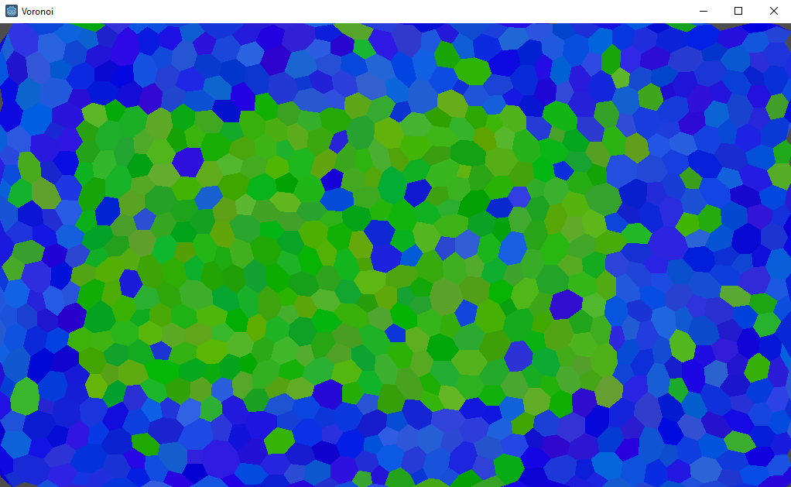

# Voronoi

## Introduction

A quick test to play with voronoi diagrams.

## How To Start

Run Voronoi.tscn as main scene in Godot.

As this is only a quick prototype it is not configurable unless u change params directly in code (/src/Map/Map.cs).

## About

By [Mitja Belak][link-author].

## 💡 Related repositories

* [Godot](https://github.com/godotengine/godot)
* [DelaunatorSharp](https://github.com/nol1fe/delaunator-sharp/tree/master/DelaunatorSharp)

## License

The MIT License (MIT). Please see [License File][link-license] for more information.

[link-license]: LICENSE.md
[link-readme]: README.md
[link-author]: https://github.com/belakm
